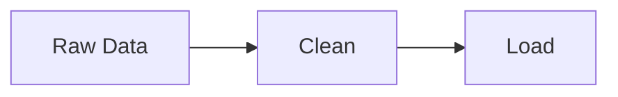

# Experimental Data Pipeline



Steps:
1. Extract raw CSV.
2. Clean missing values.
3. Load to database.

Schema snippet:
```
experiment_id INT,
result FLOAT
```

Versioning handled via Git and DVC. Scheduled with Airflow DAG `exp_data_dag`.
