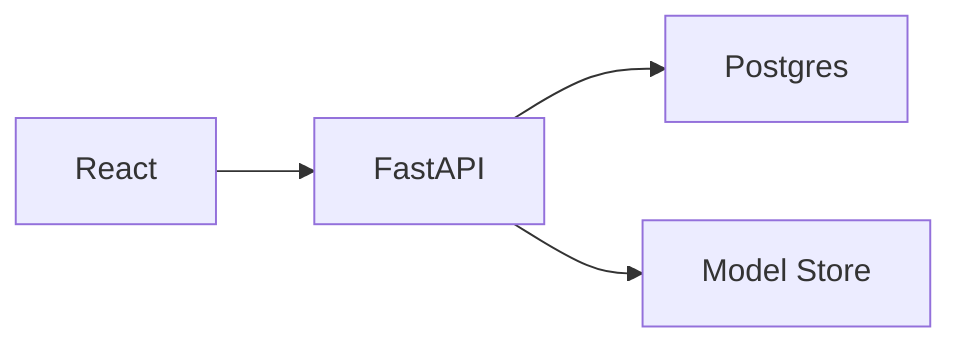

# Full-Stack Architecture

Microservice overview: React frontend → FastAPI → PostgreSQL → model store.

```mermaid
flowchart LR
  A[React] --> B[FastAPI]
  B --> C[Postgres]
  B --> D[Model Store]
```

This layout separates concerns and enables independent scaling.
