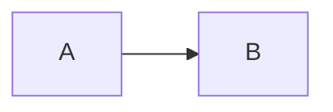

# Architecture Template

## Overview & Scope

## Goals & Constraints

## High-Level Architecture

## Components
| Name | Responsibility | Tech | Dependencies |
|------|---------------|------|--------------|

## Component Interactions / Data Flow

## Tech Stack

## Deployment & Environments

## Non-Functional Requirements

## Assumptions / Constraints

## Future Considerations

## Glossary

## References
